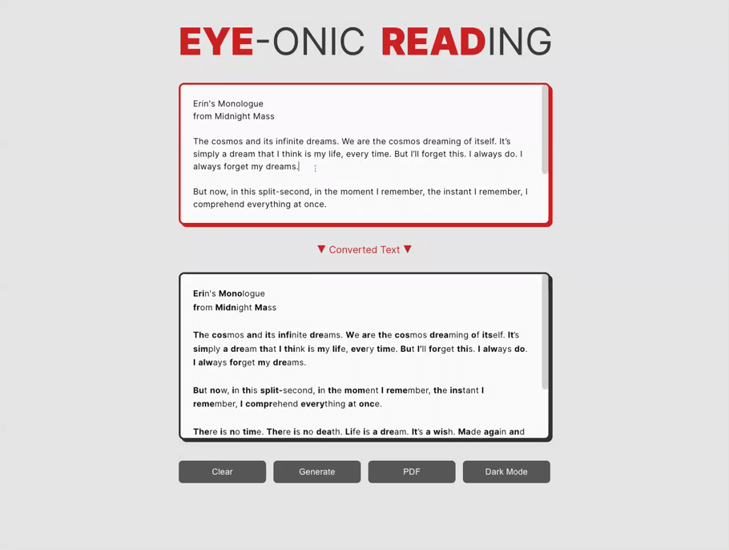

<p id="header"><p>

<table><tr>
<td> <a href="https://github.com/emjose/keto-food-list/#header"></a> </td>
<td> <a href="https://github.com/emjose/one-hundred/#header"></a> </td>
<td> <a href="https://github.com/emjose/box-of-shadows/#header"></a> </td>

</tr></table>

<br>

<p id="project-title"><p>

<a href=#table-of-contents></a>

<br>

<a href="https://eye-onic-reading.vercel.app/"></a>

#

<p id="table-of-contents"><p>

<a href=#table-of-contents></a>

-   [100 Days of Code](#100days)
-   [Tech Stack & Features](#tech-stack-and-features)
-   [Installation](#installation)
-   [Live Site](#live-site)
-   [Issues](#issues)
-   [Improvement](#improvement)
-   [Resources](#resources)
-   [Copyright](#copyright)
-   [Let's Connect!](#lets-connect)

#

<p id="100days"><p>

<a href=#100days></a>

### Day 37: August 13, 2022

-   **[Eye-onic Reading](https://eye-onic-reading.vercel.app/)** is a lightweight version of the **[Bionic Reading](https://bionic-reading.com/)** system, made for educational purposes.

-   Bionic Reading was created by **[Renato Casutt](https://bionic-reading.com/about/)**, a typographic designer from Switzerland.

-   The Bionic Reading system enhances reading by "[guiding the eyes through artificial fixation points](https://bionic-reading.com/)."

-   **Th**e **fixa**tion **poi**nts **i**n **th**is **sent**ence are **bold**ened, **an**d **he**re **i**s **a** **compa**rison **o**f **rea**ding **an**d **bio**nic **read**ing:

<br>

<a href=#100days></a>
<sup>© [Bionic Reading](https://bionic-reading.com/) GmbH, 2022, Switzerland. </sup>

#

<br>

-   When [Bionic Reading](https://bionic-reading.com/) debuted in May 2022, I was immediately fascinated because I am dyslexic. The bionic formatting made it easier for me to read.

-   The official [Bionic Reading API](https://rapidapi.com/bionic-reading-bionic-reading-default/api/bionic-reading1) is available for developers, but it is not entirely free.

-   To create **[Eye-onic Reading](https://eye-onic-reading.vercel.app/)**, the source code was derived from my **[InspecText](https://github.com/emjose/inspectext/#header)** project and from the following projects — **Many thanks to these developers!**

    -   [Bionic Reader](https://github.com/Dylaan94/bionic-reader) by [Dylan Brain](https://github.com/Dylaan94)
    -   [Bionic Text Tool](https://github.com/yohuck/bionic-text-tool) by [Eric Lake](https://github.com/yohuck)
    -   [Bionic Reading](https://github.com/mangaalai/bionicReading) by [Mangaalai](https://github.com/mangaalai)
    -   [Bionic Reading JavaScript Algorithm](https://github.com/Sparky4567/bionicreading) by [Andrius Pratusis](https://github.com/Sparky4567)
    -   [Bionic Reading](https://github.com/mohammadshg84/bionic-reading) by [Mohammad Sadegh](https://github.com/mohammadshg84)

<br>

**Important Notes:**

-   **[Eye-onic Reading](https://eye-onic-reading.vercel.app/)** is an independent, educational implementation not affiliated with Bionic Reading in any way.

-   No guarantee of any kind is made with usage of **[Eye-onic Reading](https://eye-onic-reading.vercel.app/)**.

<br>

#

<p id="tech-stack-and-features"></p>

<a href=#tech-stack-and-features></a>

-   **[Eye-onic Reading](https://eye-onic-reading.vercel.app/)** was built with HTML, vanilla JavaScript, [jQuery](https://releases.jquery.com/), and CSS.

-   Text can be typed or pasted for conversion. Random text examples can also be generated.

-   Converted text can be downloaded as a PDF with the app's usage of [jsPDF](https://artskydj.github.io/jsPDF/docs/index.html) and [html2canvas](https://html2canvas.hertzen.com/).

-   The responsive interface is minimalistic and understated to keep the focus on the text.

-   The light and dark mode color palettes were derived from the [Bionic Reading](https://bionic-reading.com/) website.

-   I enjoy [Neubrutalism](https://hype4.academy/articles/design/neubrutalism-is-taking-over-web) aesthetics, and **[Eye-onic Reading](https://eye-onic-reading.vercel.app/)** has thick borders and drop shadows to enhance accessibility and contrast.

-   Web performance has also been taken into consideration, and **[Eye-onic Reading](https://eye-onic-reading.vercel.app/)** is a [progressive web app](https://developer.mozilla.org/en-US/docs/Web/Progressive_web_apps).

<br>

#

<p id="installation"><p>

<a href=#installation></a>

#### 1. Git clone and cd into the repo folder:

```console
git clone git@github.com:emjose/eye-onic-reading.git && cd eye-onic-reading
```

#### 2. Run the command:

```console
open index.html
```

<br>

#

<p id="live-site"><p>

<a href="https://eye-onic-reading.vercel.app/"></a>

<a href="https://eye-onic-reading.vercel.app/"></a>

• Text can be entered and converted in real time, with line breaks preserved.

• **Note**: For color and demo purposes, the title's red/orange **`:hover`** state was activated for GIF examples.

<a href=#live-site></a>

<details>
<summary><b>GIF demo: Generating Text</b></summary>
<br>

<a href="https://eye-onic-reading.vercel.app/"></a>

• Users can randomly generate short excerpts of text.

• The 10 excerpts are from works of literature, TV, and film.

#

</details>

<details>
<summary><b>GIF demo: Editing Text</b></summary>
<br>

<a href="https://eye-onic-reading.vercel.app/"></a>

• The top **`textarea`** can be edited in real time, and all text can be cleared.

• Although the bottom converted text can be highlighted and copied, the bold formatting will **not** be copied.

#

</details>

<details>
<summary><b>GIF demo: Mode and local storage</b></summary>
<br>

<a href="https://eye-onic-reading.vercel.app/"></a>

• Users can toggle between light and dark mode, and mode preference will persist in local storage.

• **Note**: The title's red/orange **`:hover`** state has been activated for demo purposes.

#

</details>

<details>
<summary><b>GIF demo: PDF download</b></summary>
<br>

<a href="https://eye-onic-reading.vercel.app/"></a>

• Converted text can be downloaded as a PDF with bold formatting intact.

• Regardless of light or dark mode, the generated PDF will be black text on a white background.

</details>

<br>

#

<p id="issues"><p>

<a href=#issues></a>

### Text Issues

-   Th **`/( |\n)/`** regex in the **`split()`** method is used to split text at whitespaces **and** line breaks:

```javascript
function eyeonicReading(text) {
	const wordArray = text.split(/( |\n)/);
	...
}
```

-   However, with the current regex in place, indentation is not possible yet with the **`tab`** key or multiple spaces.

-   Without the current regex, the first word in a new line will **not** be converted.

-   The **`tab`** key can still be used for keyboard-only navigation.

-   **[Eye-onic Reading](https://eye-onic-reading.vercel.app/)** is best used for text-only content.

-   Images will not render, and emojis may convert as �� ([replacement characters](<https://en.wikipedia.org/wiki/Specials_(Unicode_block)>)).

<br>

### PDF Issues

**[Eye-onic Reading](https://eye-onic-reading.vercel.app/)** uses the [jsPDF](https://parall.ax/products/jspdf) and [html2canvas](https://html2canvas.hertzen.com/) scripts to generate PDFs, but there are limitations.

<br>

<details>
<summary><b>Click to expand: Squished Text</b></summary>
<br>

<a href=#issues></a>

<br>

-   Html2canvas renders a mock "screenshot" of the targeted DOM elements, and [representation may not be 100% accurate](https://html2canvas.hertzen.com/documentation/).

-   A single or few lines of text may appear shrunken or "squished" in the rendered PDF.

-   If text appears extra-condensed, re-pressing the PDF button will re-render the text in a more normal manner.

-   Longer or many lines of text will not have the squished appearance in the PDF.

#

</details>

<details>
<summary><b>Click to expand: Page Breaks</b></summary>
<br>

<a href=#issues></a>

<br>

-   Text does not break cleanly across multiple pages of a PDF — text is cut off and duplicated.

-   There are current [margin issues](https://github.com/parallax/jsPDF/issues) with jsPDF, but more investigation into this issue is needed.

</details>

<br>

#

<p id="improvement"><p>

<a href=#improvement></a>

**Along with finding solutions for the prior [issues](#issues), there are several areas of improvement for [Eye-onic Reading](https://eye-onic-reading.vercel.app/)**:

-   Usage of JavaScript modules for storage of generated text excerpts, or use of an API.

-   Refined media queries for landscape orientation, larger screens, and mobile devices.

-   Copy functionality for Markdown and CSS syntax.

-   Custom formatting and settings for [fixation, saccades, and font styling](https://bionic-reading.com/faster-better-focused-reading/).

<br>

#

<p id="resources"><p>

<a href=#resources></a>

-   #### [Bionic Reading](https://bionic-reading.com/)

-   #### [jsPDF](https://parall.ax/products/jspdf)

-   #### [jQuery](https://jquery.com/)

-   #### [Speakola](https://speakola.com/)

-   #### [Cloudinary](https://cloudinary.com/)

-   #### [html2canvas](https://html2canvas.hertzen.com/)

-   #### [Screencastify](https://www.screencastify.com/get-started?gclid=CjwKCAjwo_KXBhAaEiwA2RZ8hK4WM7NPKF_IFsf7MIpI0fHmY0jogS9Nk96eXBlghvL1eR4sZ8h6qRoCdrkQAvD_BwE)

-   #### [Art Departmental](https://artdepartmental.com/)

-   #### [Adobe Photoshop](https://www.adobe.com/creativecloud/buy/students.html)

-   #### [Poetry Foundation](https://www.poetryfoundation.org/)

-   #### [Generate Multipage PDF](https://www.freakyjolly.com/multipage-canvas-pdf-using-jspdf/)

-   #### [Overriding The Default Text Selection Color](https://css-tricks.com/overriding-the-default-text-selection-color-with-css/)

-   #### [The simplest CSS variable dark mode theme](https://lukelowrey.com/css-variable-theme-switcher/)

-   #### [My blog on how I created my Github READMEs](https://emmanueljose.medium.com/readme-a-makeover-story-b9c7be37a6de?sk=7ae6623d365409d875753e4604e42ffd)

<br>

#

<p id="copyright"><p>

<a href=#copyright></a>

-   Eye-onic Reading is for made for educational purposes only.

-   Eye-onic Reading is an independent, educational implementation not affiliated with [Bionic Reading](https://bionic-reading.com/) in any way.

-   No guarantee of any kind is made with usage of Eye-onic Reading.

-   [Bionic Reading](https://bionic-reading.com/) is patent of, trademark of, and copyright of © [Bionic Reading GmbH, 2022](https://bionic-reading.com/patent-trademark-2/). All Rights Reserved.

<br>

#

<p id="lets-connect">

<a href=#lets-connect></a>

<p><a href="https://twitter.com/Emmanuel_Labor"></a> <a href="https://www.linkedin.com/in/emmanuelpjose/"></a> <a href="https://emmanueljose.medium.com/"></a> <a href="https://www.instagram.com/emmanuel_jose/"></a> <a href="mailto:emjose@gmail.com"></a> <a href="https://www.emmanuel-jose.com/"></a> <a href="https://github.com/emjose"></a></p>

#

<a href=#header></a>
